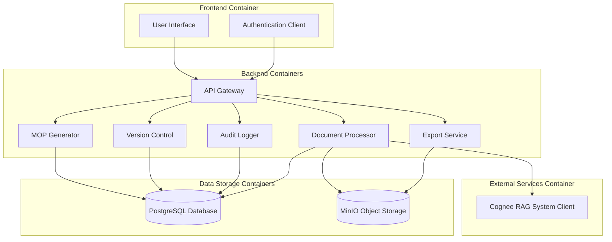
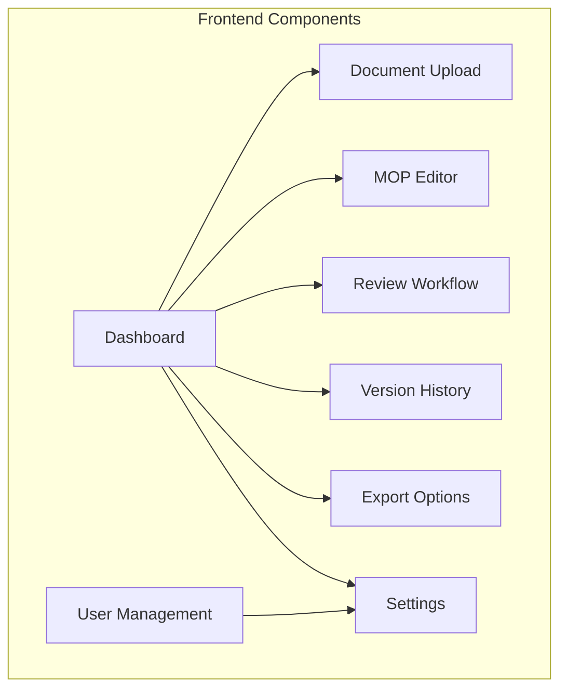
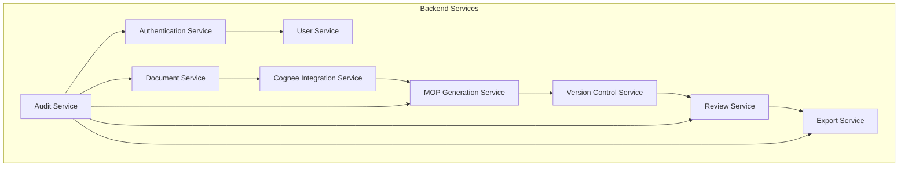
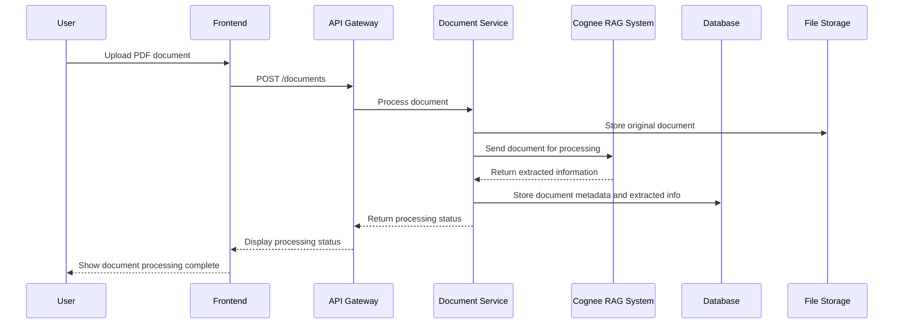
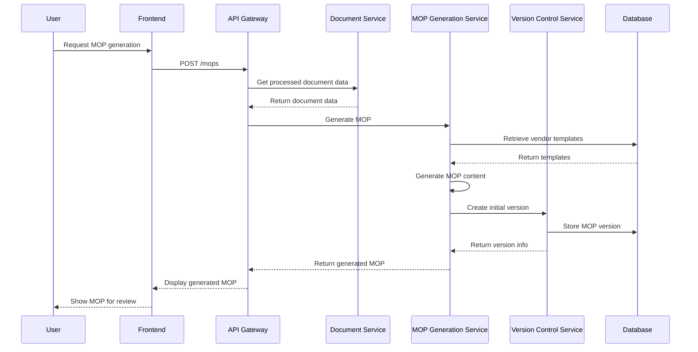
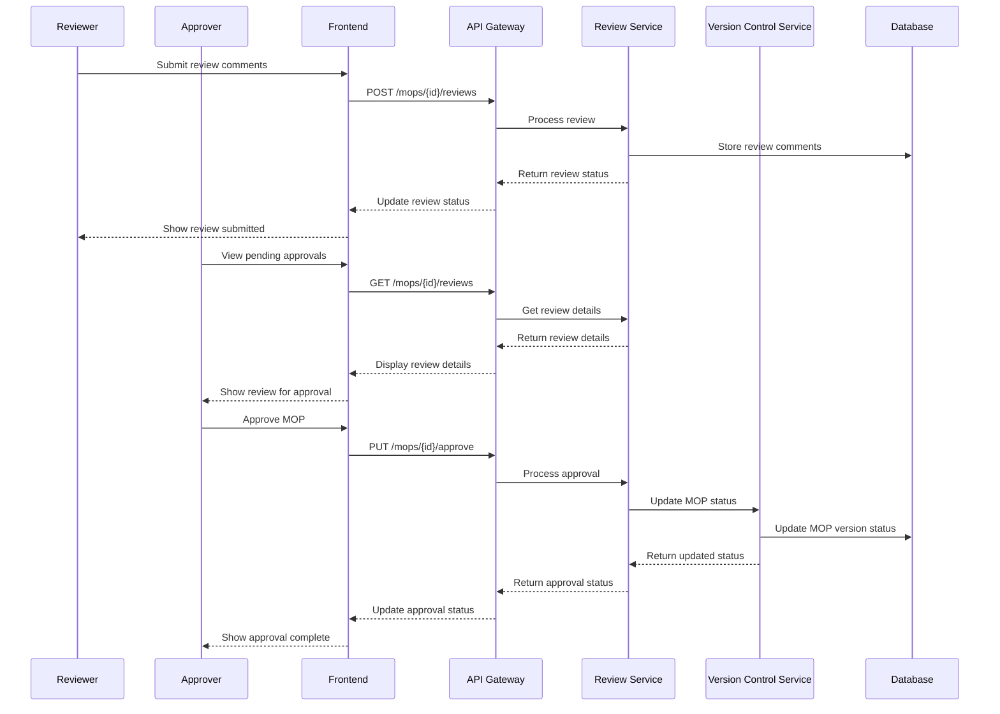
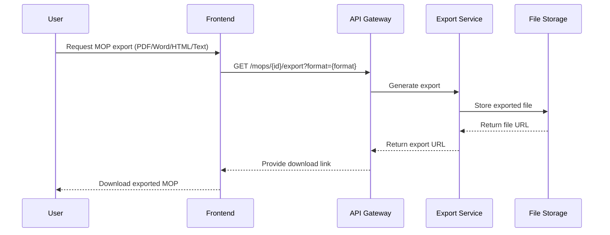
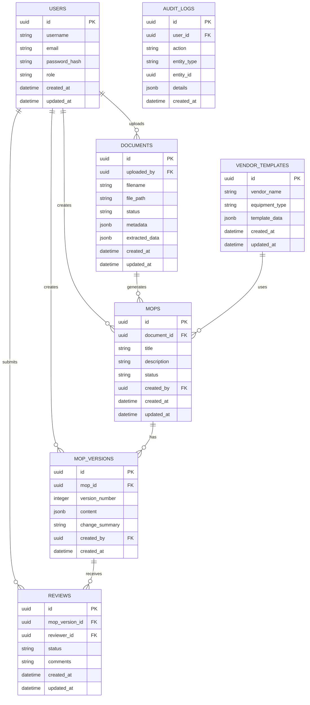
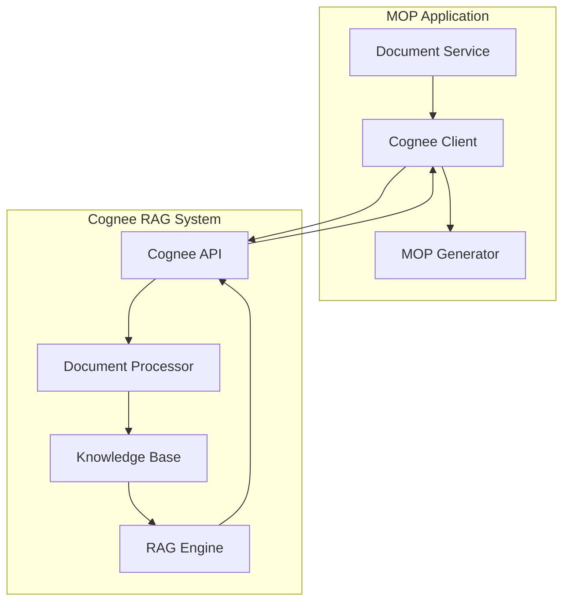
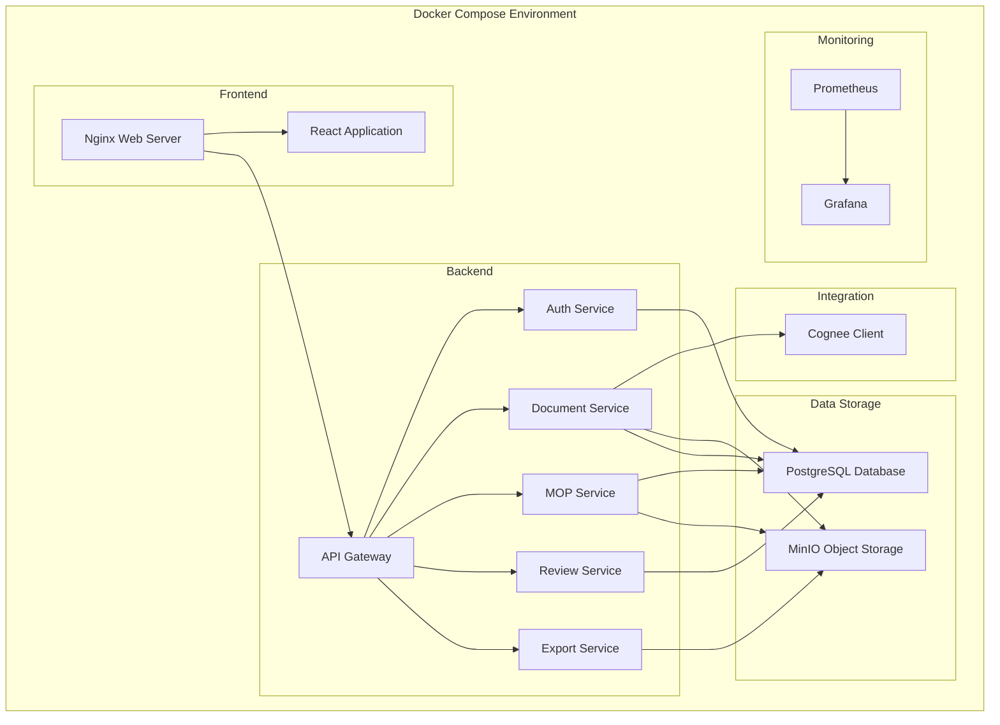

# MOP Generation Web Application - Architecture Design

## 1. System Overview

The MOP Generation Web Application will be a comprehensive on-premises solution for automatically generating Methods of Procedure documents for network operations. The system will process PDF documents containing network specifications, leverage the Cognee RAG system for intelligent document processing, and generate detailed MOPs with commands, verification steps, and rollback procedures.

### High-Level Architecture

## 2. Technology Stack Recommendations

### Frontend
- **Framework**: React.js with TypeScript
  - Provides a robust component-based architecture
  - TypeScript adds type safety and better developer experience
- **UI Library**: Material-UI or Ant Design
  - Pre-built components for faster development
  - Responsive design support
- **State Management**: Redux Toolkit
  - Centralized state management for complex application state
- **Form Handling**: Formik with Yup validation
  - Simplified form handling and validation
- **HTTP Client**: Axios
  - Promise-based HTTP client for API requests

### Backend
- **Framework**: Node.js with Express.js
  - Lightweight and flexible backend framework
  - Good performance for I/O-bound operations like API calls
- **API Documentation**: Swagger/OpenAPI
  - Self-documenting API endpoints
- **Authentication**: JWT (JSON Web Tokens)
  - Stateless authentication mechanism
- **PDF Processing**: pdf.js or pdf-lib
  - Extract text and metadata from PDF documents
- **Validation**: Joi or express-validator
  - Request validation middleware

### Database
- **Primary Database**: PostgreSQL
  - Relational database for structured data
  - Strong support for JSON data types for flexible schema
- **Object-Relational Mapping**: Prisma or TypeORM
  - Type-safe database access
  - Migration support

### Storage
- **File Storage**: MinIO
  - Self-hosted S3-compatible object storage
  - Versioning capabilities for documents and MOPs

### DevOps & Infrastructure
- **Containerization**: Docker
  - Consistent development and deployment environments
- **Orchestration**: Docker Compose
  - Multi-container orchestration for on-premises deployment
- **Reverse Proxy**: Nginx
  - Handle SSL termination and request routing
- **Monitoring**: Prometheus + Grafana
  - Application and infrastructure monitoring
- **Logging**: ELK Stack (Elasticsearch, Logstash, Kibana) or Graylog
  - Centralized logging and log analysis

## 3. Component Details

### 3.1 Frontend Components

#### Key Frontend Features:
1. **Dashboard**: Overview of recent MOPs, pending reviews, and system status
2. **Document Upload**: Interface for uploading and managing network specification PDFs
3. **MOP Editor**: Interactive editor for viewing and customizing generated MOPs
4. **Review Workflow**: Interface for collaborative review and approval processes
5. **Version History**: Timeline view of MOP versions with diff comparisons
6. **User Management**: User roles and permissions management
7. **Export Options**: Controls for exporting MOPs in various formats
8. **Settings**: Application configuration, vendor templates, and preferences

### 3.2 Backend Services

#### Key Backend Services:
1. **Authentication Service**: Handles user authentication and authorization
2. **User Service**: Manages user accounts, roles, and permissions
3. **Document Service**: Processes uploaded PDF documents
4. **Cognee Integration Service**: Interfaces with the Cognee RAG API
5. **MOP Generation Service**: Creates MOPs based on processed documents
6. **Version Control Service**: Manages MOP versions and change tracking
7. **Review Service**: Handles collaborative review workflows
8. **Export Service**: Generates MOPs in various formats (PDF, Word, HTML, text)
9. **Audit Service**: Logs system activities for audit trail

## 4. Data Flow Diagrams

### 4.1 Document Upload and Processing Flow

### 4.2 MOP Generation Flow

### 4.3 Collaborative Review Flow

### 4.4 MOP Export Flow

## 5. Database Schema

### 5.1 Core Entities

## 6. API Design

### 6.1 RESTful API Endpoints

#### Authentication
- `POST /api/auth/login` - User login
- `POST /api/auth/logout` - User logout
- `GET /api/auth/me` - Get current user info

#### Users
- `GET /api/users` - List users
- `GET /api/users/:id` - Get user details
- `POST /api/users` - Create user
- `PUT /api/users/:id` - Update user
- `DELETE /api/users/:id` - Delete user

#### Documents
- `GET /api/documents` - List documents
- `GET /api/documents/:id` - Get document details
- `POST /api/documents` - Upload document
- `DELETE /api/documents/:id` - Delete document
- `GET /api/documents/:id/status` - Check processing status

#### MOPs
- `GET /api/mops` - List MOPs
- `GET /api/mops/:id` - Get MOP details
- `POST /api/mops` - Generate new MOP
- `PUT /api/mops/:id` - Update MOP
- `DELETE /api/mops/:id` - Delete MOP
- `GET /api/mops/:id/versions` - List MOP versions
- `GET /api/mops/:id/versions/:versionId` - Get specific version
- `POST /api/mops/:id/versions` - Create new version
- `GET /api/mops/:id/export` - Export MOP (query param for format)

#### Reviews
- `GET /api/mops/:id/reviews` - List reviews for MOP
- `POST /api/mops/:id/reviews` - Create review
- `PUT /api/mops/:id/reviews/:reviewId` - Update review
- `POST /api/mops/:id/approve` - Approve MOP
- `POST /api/mops/:id/reject` - Reject MOP

#### Vendor Templates
- `GET /api/templates` - List templates
- `GET /api/templates/:id` - Get template details
- `POST /api/templates` - Create template
- `PUT /api/templates/:id` - Update template
- `DELETE /api/templates/:id` - Delete template

#### Audit
- `GET /api/audit` - List audit logs (with filtering)

## 7. Cognee RAG Integration

### 7.1 Integration Architecture

### 7.2 Integration Approach

1. **Cognee Client Service**:
   - Handles authentication with Cognee API
   - Manages API rate limiting and retries
   - Transforms document data to Cognee's expected format
   - Processes and normalizes Cognee's responses

2. **Document Processing Flow**:
   - Extract text from PDF documents
   - Send document content to Cognee API
   - Receive structured data extraction results
   - Store extracted network specifications, requirements, and configurations

3. **MOP Generation Integration**:
   - Use extracted data to generate appropriate commands
   - Apply vendor-specific templates based on identified equipment
   - Generate verification steps based on expected outcomes
   - Create rollback procedures for each step

4. **Error Handling**:
   - Implement robust error handling for API failures
   - Provide fallback mechanisms for partial processing
   - Log all integration activities for troubleshooting

## 8. Docker Deployment Architecture

### 8.1 Container Architecture

### 8.2 Docker Compose Configuration

The application will be deployed using Docker Compose with the following services:

1. **nginx**: Reverse proxy and static file server for the frontend
2. **frontend**: React application container
3. **api-gateway**: API Gateway service
4. **auth-service**: Authentication and user management
5. **document-service**: Document processing service
6. **mop-service**: MOP generation service
7. **review-service**: Review and approval workflow service
8. **export-service**: MOP export service
9. **cognee-client**: Cognee RAG integration service
10. **postgres**: PostgreSQL database
11. **minio**: MinIO object storage
12. **prometheus**: Monitoring system
13. **grafana**: Visualization and alerting

### 8.3 Volume Management

Persistent data will be stored in Docker volumes:

1. **postgres-data**: Database files
2. **minio-data**: Object storage files
3. **app-logs**: Application logs

## 9. Security Considerations

### 9.1 Authentication and Authorization

1. **JWT-based Authentication**:
   - Secure token-based authentication
   - Short-lived access tokens with refresh token mechanism
   - Token revocation capabilities

2. **Role-Based Access Control (RBAC)**:
   - Define roles: Admin, Manager, Engineer, Viewer
   - Permission-based access to resources
   - Audit logging for access attempts

### 9.2 Data Security

1. **Data Encryption**:
   - Encryption at rest for database and file storage
   - TLS/SSL for all communications
   - Secure handling of sensitive network configuration data

2. **Input Validation**:
   - Strict validation of all user inputs
   - Protection against common web vulnerabilities (XSS, CSRF, etc.)
   - File upload validation and scanning

### 9.3 Network Security

1. **Container Network Isolation**:
   - Internal network for container communication
   - Expose only necessary ports to the host
   - Use of network policies to restrict traffic

2. **Reverse Proxy Configuration**:
   - HTTPS enforcement
   - HTTP security headers
   - Rate limiting to prevent abuse

## 10. Scalability Considerations

While the initial deployment is designed for small-scale usage, the architecture allows for future scaling:

1. **Horizontal Scaling**:
   - Stateless services can be scaled horizontally
   - Load balancing for increased traffic

2. **Database Scaling**:
   - Connection pooling
   - Read replicas for scaling read operations
   - Potential sharding for very large deployments

3. **Asynchronous Processing**:
   - Message queue implementation for document processing
   - Background workers for CPU-intensive tasks

## 11. Implementation Roadmap

### Phase 1: Core Infrastructure
- Set up Docker environment
- Implement database schema
- Create basic API structure
- Develop authentication system

### Phase 2: Document Processing
- Implement document upload and storage
- Develop Cognee integration
- Create document extraction pipeline

### Phase 3: MOP Generation
- Implement MOP generation logic
- Develop vendor-specific templates
- Create version control system

### Phase 4: Collaboration Features
- Implement review workflows
- Develop approval processes
- Create notification system

### Phase 5: Export and Reporting
- Implement export functionality
- Develop audit logging
- Create reporting features

### Phase 6: UI/UX and Testing
- Develop frontend interface
- Implement responsive design
- Conduct comprehensive testing