# MOP Generation Web Application - Project Plan

## 1. Project Overview

### 1.1 Project Description
The MOP Generation Web Application is an on-premises solution for automatically generating Methods of Procedure documents for network operations. The system will process PDF documents containing network specifications, leverage the Cognee RAG system for intelligent document processing, and generate detailed MOPs with commands, verification steps, and rollback procedures.

### 1.2 Project Objectives
- Create a secure, on-premises web application for MOP generation
- Integrate with the existing Cognee RAG system
- Provide a user-friendly interface for document upload and MOP management
- Implement collaborative review workflows
- Support multiple export formats
- Ensure comprehensive audit logging and version control

### 1.3 Key Constraints
- Small development team (3 developers)
- On-premises deployment with strict security requirements
- Integration with existing Cognee RAG system

## 2. Team Structure and Responsibilities

With a small team of 3 developers, we'll need a flexible approach where each team member takes on multiple roles:

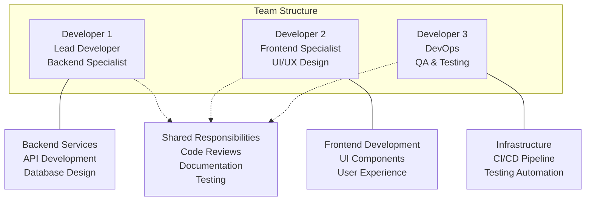

### 2.1 Role Rotation
To prevent knowledge silos and ensure project continuity:
- Weekly knowledge sharing sessions
- Cross-training on critical components
- Documentation of all development decisions

## 3. Project Phases and Timeline

Given the complexity and small team size, we recommend a 15-month timeline divided into 6 phases:

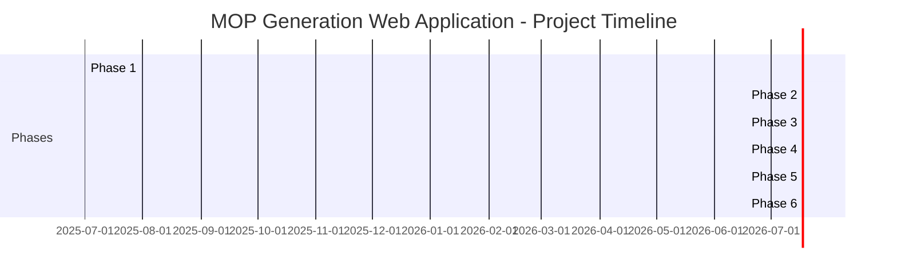

### 3.1 Phase Milestones

#### Phase 1: Project Setup & Infrastructure (2 months)
- Development environment setup
- Docker configuration
- Database schema implementation
- CI/CD pipeline setup
- Basic project structure

#### Phase 2: Core Backend Development (3 months)
- Authentication service
- Document processing service
- MOP generation service
- Version control service
- Basic API endpoints

#### Phase 3: Frontend Development (3 months)
- UI component library
- Dashboard implementation
- Document upload interface
- MOP editor
- User management screens

#### Phase 4: Integration & Testing (3 months)
- Cognee RAG integration
- Review workflow implementation
- Export functionality
- End-to-end testing
- User acceptance testing

#### Phase 5: Security Hardening & Optimization (2 months)
- Security audit and fixes
- Performance optimization
- Load testing
- Error handling improvements
- Monitoring implementation

#### Phase 6: Deployment & Documentation (2 months)
- Production deployment
- User documentation
- Admin documentation
- Knowledge transfer
- Post-deployment support setup

## 4. Detailed Task Breakdown

### 4.1 Phase 1: Project Setup & Infrastructure

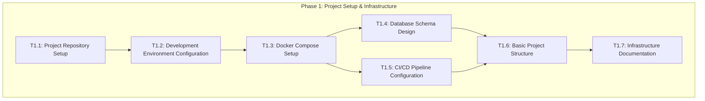

#### Tasks and Estimates

| Task ID | Task Description | Assigned To | Duration | Dependencies |
|---------|-----------------|-------------|----------|--------------|
| T1.1 | Project repository setup | Dev1 | 1 week | None |
| T1.2 | Development environment configuration | Dev3 | 1 week | T1.1 |
| T1.3 | Docker Compose setup | Dev3 | 2 weeks | T1.2 |
| T1.4 | Database schema design and implementation | Dev1 | 3 weeks | T1.3 |
| T1.5 | CI/CD pipeline configuration | Dev3 | 2 weeks | T1.3 |
| T1.6 | Basic project structure (frontend & backend) | Dev1, Dev2 | 2 weeks | T1.4, T1.5 |
| T1.7 | Infrastructure documentation | Dev3 | 1 week | T1.6 |

### 4.2 Phase 2: Core Backend Development

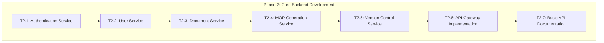

#### Tasks and Estimates

| Task ID | Task Description | Assigned To | Duration | Dependencies |
|---------|-----------------|-------------|----------|--------------|
| T2.1 | Authentication service implementation | Dev1 | 3 weeks | Phase 1 |
| T2.2 | User service implementation | Dev1 | 2 weeks | T2.1 |
| T2.3 | Document service implementation | Dev1, Dev3 | 4 weeks | T2.2 |
| T2.4 | MOP generation service implementation | Dev1, Dev2 | 4 weeks | T2.3 |
| T2.5 | Version control service implementation | Dev1 | 3 weeks | T2.4 |
| T2.6 | API gateway implementation | Dev3 | 2 weeks | T2.5 |
| T2.7 | Basic API documentation (Swagger/OpenAPI) | Dev3 | 2 weeks | T2.6 |

### 4.3 Phase 3: Frontend Development

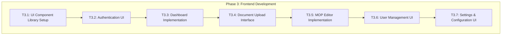

#### Tasks and Estimates

| Task ID | Task Description | Assigned To | Duration | Dependencies |
|---------|-----------------|-------------|----------|--------------|
| T3.1 | UI component library setup | Dev2 | 2 weeks | Phase 2 |
| T3.2 | Authentication UI implementation | Dev2 | 2 weeks | T3.1 |
| T3.3 | Dashboard implementation | Dev2 | 3 weeks | T3.2 |
| T3.4 | Document upload interface | Dev2, Dev3 | 3 weeks | T3.3 |
| T3.5 | MOP editor implementation | Dev2, Dev1 | 4 weeks | T3.4 |
| T3.6 | User management UI | Dev2 | 2 weeks | T3.5 |
| T3.7 | Settings & configuration UI | Dev2 | 2 weeks | T3.6 |

### 4.4 Phase 4: Integration & Testing

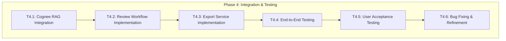

#### Tasks and Estimates

| Task ID | Task Description | Assigned To | Duration | Dependencies |
|---------|-----------------|-------------|----------|--------------|
| T4.1 | Cognee RAG integration | Dev1, Dev3 | 4 weeks | Phase 3 |
| T4.2 | Review workflow implementation | Dev1, Dev2 | 3 weeks | T4.1 |
| T4.3 | Export service implementation | Dev3 | 3 weeks | T4.2 |
| T4.4 | End-to-end testing | All | 2 weeks | T4.3 |
| T4.5 | User acceptance testing | All | 2 weeks | T4.4 |
| T4.6 | Bug fixing & refinement | All | 2 weeks | T4.5 |

### 4.5 Phase 5: Security Hardening & Optimization

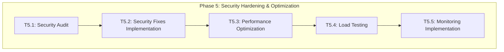

#### Tasks and Estimates

| Task ID | Task Description | Assigned To | Duration | Dependencies |
|---------|-----------------|-------------|----------|--------------|
| T5.1 | Security audit | Dev1, Dev3 | 2 weeks | Phase 4 |
| T5.2 | Security fixes implementation | All | 3 weeks | T5.1 |
| T5.3 | Performance optimization | Dev1, Dev2 | 2 weeks | T5.2 |
| T5.4 | Load testing | Dev3 | 1 week | T5.3 |
| T5.5 | Monitoring implementation | Dev3 | 2 weeks | T5.4 |

### 4.6 Phase 6: Deployment & Documentation

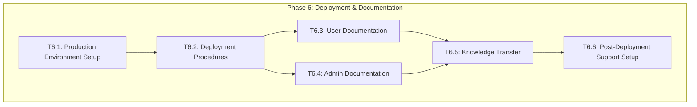

#### Tasks and Estimates

| Task ID | Task Description | Assigned To | Duration | Dependencies |
|---------|-----------------|-------------|----------|--------------|
| T6.1 | Production environment setup | Dev3 | 2 weeks | Phase 5 |
| T6.2 | Deployment procedures | Dev3 | 2 weeks | T6.1 |
| T6.3 | User documentation | Dev2 | 3 weeks | T6.2 |
| T6.4 | Admin documentation | Dev1 | 3 weeks | T6.2 |
| T6.5 | Knowledge transfer | All | 1 week | T6.3, T6.4 |
| T6.6 | Post-deployment support setup | All | 1 week | T6.5 |

## 5. Risk Management

### 5.1 Identified Risks

| Risk ID | Risk Description | Probability | Impact | Mitigation Strategy |
|---------|-----------------|-------------|--------|---------------------|
| R1 | Team capacity constraints due to small team size | High | High | Prioritize features, use pre-built components, implement iterative development |
| R2 | Integration issues with Cognee RAG system | Medium | High | Early proof-of-concept, thorough API documentation review, regular integration testing |
| R3 | Security vulnerabilities in on-premises deployment | Medium | High | Regular security audits, following security best practices, penetration testing |
| R4 | Performance issues with large documents | Medium | Medium | Performance testing early, optimization strategies, pagination and lazy loading |
| R5 | Scope creep | High | Medium | Clear requirements documentation, change management process, regular stakeholder reviews |
| R6 | Knowledge silos due to specialized work | High | Medium | Documentation, knowledge sharing sessions, pair programming |
| R7 | Technical debt accumulation | High | Medium | Code reviews, refactoring sprints, technical debt tracking |

### 5.2 Risk Monitoring

- Weekly risk assessment during team meetings
- Risk register updates
- Proactive mitigation strategy implementation
- Regular stakeholder communication about risks

## 6. Quality Assurance Plan

### 6.1 Testing Strategy

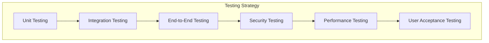

### 6.2 Testing Approaches

| Testing Type | Description | Tools | Responsibility |
|--------------|-------------|-------|----------------|
| Unit Testing | Testing individual components in isolation | Jest, Mocha | All developers |
| Integration Testing | Testing interactions between components | Supertest, Postman | Dev1, Dev3 |
| End-to-End Testing | Testing complete user flows | Cypress, Selenium | Dev2, Dev3 |
| Security Testing | Identifying vulnerabilities | OWASP ZAP, SonarQube | Dev1, Dev3 |
| Performance Testing | Evaluating system performance | JMeter, Lighthouse | Dev3 |
| User Acceptance Testing | Validating against requirements | Manual testing | All |

### 6.3 Quality Metrics

- Code coverage: >80%
- Maximum acceptable bug severity for release: Medium
- Performance benchmarks: Page load <2s, API response <500ms
- Security: No high or critical vulnerabilities

## 7. Deployment Strategy

### 7.1 Deployment Environments

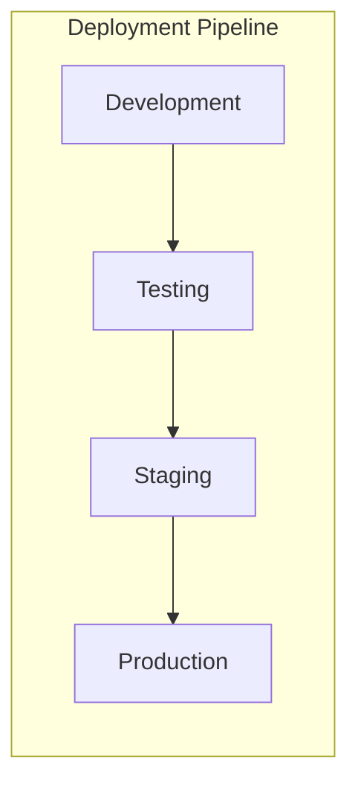

### 7.2 Deployment Process

1. **Development Environment**
   - Continuous integration with each commit
   - Automated unit and integration tests
   - Developer testing

2. **Testing Environment**
   - Weekly deployments
   - Automated end-to-end tests
   - QA testing

3. **Staging Environment**
   - Bi-weekly deployments
   - Performance and security testing
   - Pre-production validation

4. **Production Environment**
   - Monthly deployments
   - Scheduled maintenance windows
   - Rollback procedures

### 7.3 On-Premises Deployment Considerations

- Network security configuration
- Data center hardware requirements
- Backup and disaster recovery procedures
- Monitoring and alerting setup

## 8. Post-Deployment Support

### 8.1 Support Levels

- **Level 1**: Basic user support and troubleshooting
- **Level 2**: Technical issue investigation and resolution
- **Level 3**: Complex problem solving and system modifications

### 8.2 Documentation

- User manuals
- Administrator guides
- API documentation
- Troubleshooting guides

### 8.3 Maintenance Plan

- Regular security updates
- Performance monitoring and optimization
- Feature enhancements based on user feedback
- Quarterly system reviews

## 9. Feature Prioritization

Given the small team size, features should be prioritized based on business value and technical dependencies:

### 9.1 Must-Have Features (MVP)

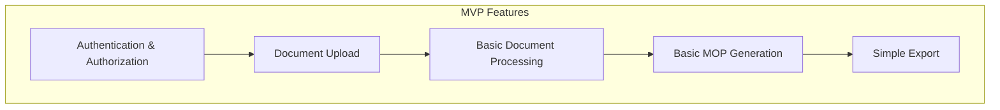

### 9.2 Should-Have Features (Post-MVP)

- Version control
- Review workflows
- Advanced MOP editor
- User management
- Audit logging

### 9.3 Could-Have Features (Future Enhancements)

- Advanced export options
- Dashboard analytics
- Template customization
- Batch processing
- Integration with other systems

## 10. Conclusion and Next Steps

This project plan outlines a comprehensive approach to developing the MOP Generation Web Application with a small team of 3 developers over a 15-month period. The plan prioritizes core functionality while managing risks associated with the team size and technical complexity.

### 10.1 Immediate Next Steps

1. Finalize and approve the project plan
2. Set up the development environment and infrastructure
3. Begin implementation of core backend services
4. Establish regular progress tracking and reporting

### 10.2 Key Success Factors

- Clear communication and documentation
- Regular progress reviews and adjustments
- Focus on core functionality before enhancements
- Continuous testing and quality assurance
- Knowledge sharing among team members